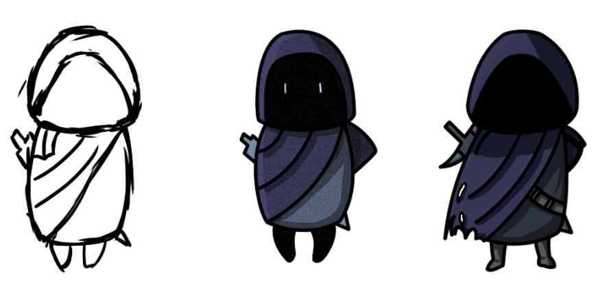

# Watchers
A 2D platformer game with handdrawn sprites and an art & combat style that's heavily inspired by Hollow Knight and other metroidvanias.
# About This Project
This project is considered to be a solo, learning project to improve at C# and Unity while also picking up some art & design skills (and having fun ofc). It's aimed to use the Universal Render Pipeline later for better 2D lights and will contain an inventory and basic skill system.
#Try It!
This project has a WebGL version published at: https://simmer.io/@Dave94Punk/2d-platformer-movement-prototype. Give it a try and leave your feedback!

